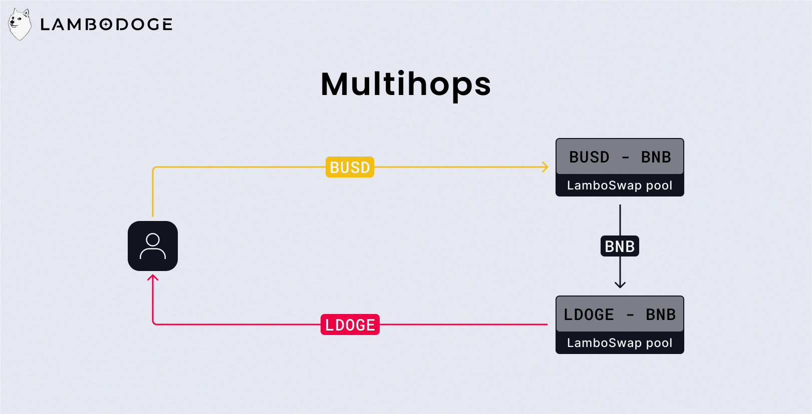

# What is LamboSwap?

LamboSwap is the decentralised application developed by the LamboDoge project. At the moment of writing this, LamboSwap allows to swap BEP-20 tokens, add or remove liquidity, and stake tokens into multiple pools.

In this post, I'll explain how each menu of the application works, in order to offer you the best possible user experience.

---

# Swap

## Swapping: Basics

### Automated Market Maker

LamboSwap's swap follows the Automated Market Maker (AMM) approach. Each pair is represented by a liquidity pool, 2 stocks of assets whose value is identical. For example the pair `LDOGE/BNB` holds a stock of `LDOGE` and a stock of `BNB`, the price of `LDOGE` in `BNB` will be calculated based on the principle that the quantity of `LDOGE` in the pool had the same value that the quantity of `BNB` in this same pool.

A pool `LDOGE/BNB` with `1000 LDOGE` and `10 BNB` would means that `1000 LDOGE` is worth `10 BNB`. So `1 LDOGE` is worth `0.01 BNB`.

### Price impact

In the context of the `LDOGE/BNB` pool, if a user wants to swap his `BNB` against some `LDOGE`, he will actually deposit his `BNB` in the pool and take some `LDOGE` in exchange. This action has the effect of changing the price of `LDOGE`, since the ratio `LDOGE` `BNB` in the pool is no longer the same.

The more is exchanged, the more the ratio will change, and so the more the price will change too. This rate of change is called **price impact**.

### Multihops

Multihops allows to exchange any tokens, even if no pair exists between these 2 tokens. For example if there's a pair `LDOGE/BNB` and a pair `BUSD/BNB`, but no `LDOGE/BUSD` pair, thanks to multihops, it is now possible to exchange some `LDOGE` against some `BUSD`, by finding a path between other pools

### Slippage tolerance

When performing a swap, the interface displays the quantity of tokens which will be received. However, if the token applies a tax or a trade modify the price right before the confirmation of your transaction, the displayed quantity may vary from the received quantity. If the difference in amount exceeds the slippage tolerance, the transaction will be reverted.

For example, for a token applying a 4% tax, slippage tolerance must be at least 4%.

## Swap with LamboSwap

The swapping interface is quite intuitive. Just select:

- An input token
- An output token
- An output amount to send or to receive

If your balance is sufficient, the transaction can be confirmed.

<Video option="SwapDemo" description="Demonstration of the swapping interface" />

## Transaction settings

For a more advanced use, it's possible to adjust some parameters:

- The **slippage tolerance**, 5% by default.
- The **transaction deadline**, if a swap has been pending for longer than this parameter, it will be automatically cancelled, 30 minutes by default.
- The **multihops** autorisation, enabled by default.
- The **expert mode**, disabled by default.

### Expert mode

The expert mode consists of the disabling of 2 safeties:

- The confirmation screen
- The maximum 15% price impact limitation

---

# Pool

## Liquidity providing: Basics

### LP Tokens

When you supply liquidity in a pool, the protocol give you some **LP tokens** in exchange. These tokens represent your share of the pool and will allow you to get your liquidity back later.

### Impermanent loss

Impermanent losses occur when you supply liquidity to a pool and the price of the tokens you supplied change. It is therefore possible to lose money by providing liquidity.

Hopefully the fees you earn may be able to compensate for those losses. At each swap, a fee of 0.3% is charged to be distributed to liquidity providers. On the long run, despite the impermanent losses, the liquidity providing remains profitable.

Now, let's see how these impermanent losses work.

You deposit `1 BNB` and `100 BUSD` in the `BNB/BUSD` pool. The tokens must have an equivalent value, which means that the `BNB` price is `100 BUSD`, we can deduce that your deposit has a value of `200 BUSD`.

The pool contains a total of `10 BNB` and `1000 BUSD`, so you own 10% of the pool.

Now let's say that after a few days, the `BNB` price increases to `400 BUSD`, in the pool there's now `5 BNB` and `2000 BNB`. You're still owning 10% of the pool, thus `200 BUSD` and `0.5 BNB`, worth `400 BUSD`. But if you had decided to keep your tokens without adding them to the pool, you would now have `1 BNB` and `100 BUSD`, worth `500 BUSD`.

Supplying liquidity made you lose `100 BUSD`.

Of course, this example is quite extreme, we assumed that the price of BNB was multiplied by 4 in a few days. But it does illustrate well the mechanism behind impermanent losses.

## Providing liquidity

Now that you have all the knowledge you need to understand what adding liquidity involves, it's time for the practical.

<Video option="AddLiquidityDemo" description="Demonstration of the liquidity providing interface" />

After adding liquidity you will notice on your address the presence of **LP tokens**.

## Withdrawing liquidity

You supplied liquidity, and now wants to get your tokens back. The protocol will burn your **LP tokens** and withdraw the percentage corresponding to your pool share.

<Video option="RemoveLiquidityDemo" description="Demonstration of the liquidity withdrawing interface" />

If the pool where you have added your liquidity doesn't appear on the interface, just import it using the **Import pool** button.

---

# Stake

## Staking: Basics

### What is staking

Staking consists in locking tokens on a smart contract (a staking pool) in exchange of interests in the form of other tokens. You may think of a staking pool as 2 stocks of tokens, a stock made of tokens that users lock, and a stock made of tokens that users receive.

### LamboStake

Our staking offer is base on the **LamboStake** protocol. We have the possibility to create any staking pool, the create of a pool requires the setting of some parameters:

- **The token to stake:** The address of the token that users will have to lock in the pool.
- **The token do distribute:** The address of the token that will be distributed to stakers
- **The frequency of distribution:** The interest distribution frequency.
- **The quantity distributed by period:** The amount of tokens that will be distributed to stakers on each distribution.
- **The minimum to stake:** The minimum amount of tokens to stake to start receiving interest.
- **The minimum number of stakers:** The minimum number of stakers required in the pool for the full interest to be distributed. This parameter prevents a small number of stakers from receiving too many tokens.
- **The total minimum to be staked:** Like the minimum number of stakers, this parameter corresponds to the minimum amount of tokens that must be locked in the pool for the full interest to be distributed.
- **The tax:** The amount deposit and withdrawal fees in the pool. In the case where the token to be stacked and the token to be distributed are the same, this tax is used to feed the stock of tokens to be distributed.

Once the pool is configure, deployed, and the stock of tokens to distribute filled, it will automatically appear on the LamboSwap staking interface.

### Liquidity mining

As seen above, liquidity providers are exposed to capital loss risks. even is in most of the time, the fees earned are able to compensate for those losses. To incentivise liquidity providing even more, we need to increase the yield, without increasing the transaction fees, which would reduce the quality of the user experience.

This is where liquidity mining comes in, a staking pool where the token to stake is a LP token. Thus users can provide liquidity, receive some LP tokens in exchange, and then stake them to receive additional interest on their liquidity providing.

*More liquidity means a more stable price and a better price floor.*

## Stake with LamboSwap

In the **Stake** menu of LamboSwap appear the list of available staking pools, and some informations about each pool:

- The pool's tokens, in the form `TOKEN TO STAKE / TOKEN TO RECEIVE`.
- The APY, the one-year rate of return (this rate is subject to change).
- The TVL in dollars, the total value of the stock of tokens locked in the pool.

### Deposit

<Video option="StakeDemo" description="Demonstration of a LDOGE deposit in a staking pool" />

### Claim and Retrieve

Once you've staked your tokens, the pool will calculate your interest according to its parameters. As long as these interests are not claimed, depending on the activity within the pool, their amount can change up or down. To secure your gains you just have to **Claim** them, and to transfer them to your address you have to **Retrieve** them (LamboStake automatically performs a **Claim** before each **Retrieve**).

For pools where the token to stake and the token receive are the same, the **Retrieve** action will automatically add your gains back to the pool.

The **Retrieve** action by moving tokens from one address to another will consume much more gas than a simple **Claim**. It is therefore better to **Claim** your interests frequently and **Retrieve** them only when needed.

### Withdraw

Finally, it is possible to withdraw your tokens from the staking pool at any time (LamboStake automatically performs a **Retrieve** before each withdrawal).

<Video option="UnstakeDemo" description="Demonstration of a LDOGE withdrawal in a staking pool" />
