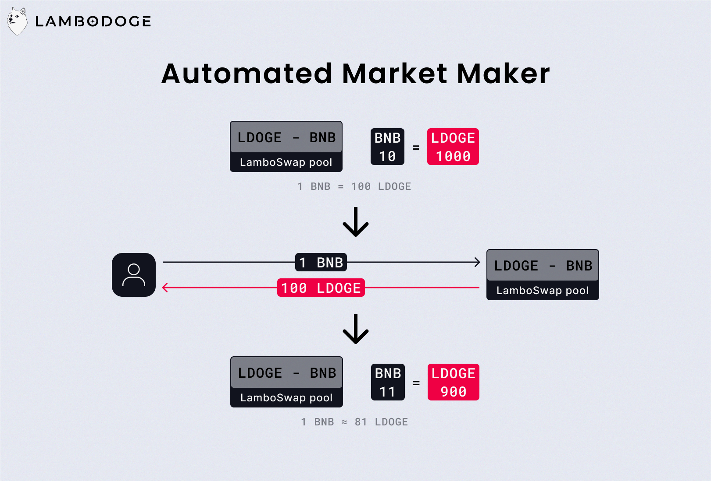
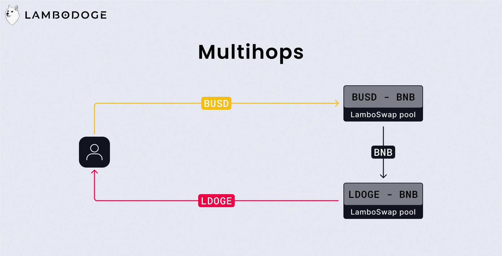

# Qu'est ce que LamboSwap?

LamboSwap est l'application décentralisée développé par le projet LamboDoge. Au moment de l'écriture de cet article, LamboSwap permet de swapper des tokens BEP-20, ajouter ou retirer de la liquidité, et staker des tokens dans différentes pools.

Dans cet article, je vais expliquer le fonctionnement de chaque menu de l'application, afin de vous offrir la meilleure experience utilisateur possible.

---

# Swap

## Swapping: Notions de base

### Automated Market Maker

Le swap de LamboSwap fonctionne sur le model de l'Automated Market Maker (AMM). Chaque paire est représentée par une pool de liquidité, un stock de 2 actifs dont la valeur est identique. Par exemple la paire `LDOGE/BNB` détient un stock de `LDOGE` ainsi qu'un stock de `BNB`, le prix du `LDOGE` en `BNB` sera alors calculé en partant du principe que la quantité de `LDOGE` dans la pool a la même valeur que la quantité de `BNB` dans cette même pool.

Une pool `LDOGE/BNB` avec `1000 LDOGE` et `10 BNB` signifierait que `1000 LDOGE` valent `10 BNB`. Donc `1 LDOGE` vaut `0.01 BNB`.

### Price impact

En gardant l'exemple de la pool `LDOGE/BNB`, si un utilisateur désire swapper ses `BNB` contre des `LDOGE`, il va en réalité déposer ses `BNB` dans la pool et prendre des `LDOGE` en échange. Cette action a pour effet de changer le prix du `LDOGE`, puisque le ratio `LDOGE` `BNB` dans la pool n'est plus le même.

Plus la quantité échangée est importante, plus le ratio va changer, et donc plus prix va changer aussi. C'est ce taux de changement du prix que l'on appelle le **price impact**.

### Multihops

Les multihops permettent d'échanger n'importe quels tokens, même si aucune paire n'existe entre ces 2 tokens. Par exemple s'il existe une paire `LDOGE/BNB` ainsi qu'une paire `BUSD/BNB`, mais aucune paire `LDOGE/BUSD`, grace aux multihops, il est possible d'échanger du `LDOGE` contre du `BUSD`, en trouvant un chemin entre d'autres pools.

### Slippage tolerance

Au moment d'effectuer un swap, l'interface affiche la quantité de tokens qui vont être reçus. Cependant, si le token applique une taxe ou qu'un trade modifie le prix juste avant la confirmation de votre transaction, la quantité affichée peut varier par rapport à la quantité finalement reçue.
Si la différence de montant dépasse la slippage tolerance, la transaction est annulée.

Par exemple, pour un token appliquant une taxe de 4%, la slippage tolerance doit être d'au moins 4%.

## Swapper avec LamboSwap

L'interface de swapping est assez intuitive. Il suffit de sélectionner:

- un token d'entrée
- un token de sortie
- un montant à envoyer ou à recevoir

Si votre balance est suffisante, la transaction peut être confirmée.

<Video option="SwapDemo" description="Demonstration de l'interface de swapping" />

## Transaction settings

Pour une utilisation un peu plus avancé, il est possible d'ajuster quelques paramètres:

- la **slippage tolérance**, 5% par défaut.
- la **transaction deadline**, si un swap est en attente depuis plus longtemps que ce paramètre, il sera automatiquement annulé, 30 minutes par défaut.
- l'autorisation des **multihops**, activée par défaut.
- le **mode expert**, désactivé par défaut.

### Mode expert

Le mode expert consiste en la désactivation de 2 sécurités:

- l'écran de confirmation des swaps
- la limitation à des swap avec un price impact inférieur à 15%

---

# Pool

## Apport de Liquidité: Notions de base

### LP Tokens

Lorsque vous fournissez de la liquidité dans une pool, le protocol vous donne en échange des **LP tokens**. Ces tokens représentent votre part de la pool et vous permettrons de récupérer votre liquidité plus tard.

### Pertes non permanentes

Les pertes non permanentes (impermanent loss) surviennent lorsque vous ajoutez de la liquidité dans une pool et que le prix des tokens que vous avez fourni change. Il est donc possible de perdre de l'argent en fournissant de la liquidité.

Heureusement ce risque de perte est compensé par les frais de transaction. À chaque swap, une taxe de 0.3% est prélevée pour être distribuée aux fournisseurs de liquidité. Sur le long terme, malgré les pertes non permanentes, l'apport de liquidité reste rentable.

Maintenant, voyons ensemble comment fonctionnent les pertes non permanentes

Vous déposez `1 BNB` et `100 BUSD` dans la pool `BNB/BUSD`. Les tokens doivent avoir une valeur équivalente, ce qui signifie que le prix du `BNB` est de `100 BUSD`, on peut en déduire que votre dépôt a une valeur de `200 BUSD`.

La pool contient au total `10 BNB` et `1000 BUSD`, vous détenez donc 10% de la pool.

Admettons maintenant qu'après quelques jours, le prix  du `BNB` passe à `400 BUSD`, dans la pool il y a maintenant `5 BNB` et `2000 BUSD`. Vous détenez toujours 10% de cette pool, soit `200 BUSD` et `0.5 BNB`, d'une valeur de `400 BUSD`. Mais si vous aviez décidé de garder vos tokens sans les ajouter dans la pool, vous auriez maintenant `1 BNB` et `100 BUSD`, d'une valeur de `500 BUSD`.

Ajouter de la liquidité vous a donc fait perdre `100 BUSD`.

Évidement, ce cas est assez extrême, nous sommes partis du principe que le prix du BNB a été multiplié par 4 en quelques jours. Mais il illustre bien le mécanisme derrière les pertes non permanentes.

## Ajouter de la liquidité

Maintenant que vous avez toutes les connaissances nécessaires pour comprendre ce qu'implique l'ajout de liquidité, il est temps de passer à la pratique.

<Video option="AddLiquidityDemo" description="Demonstration de l'interface d'ajout de liquidité" />

Après avoir ajouté de liquidité vous remarquerez sur votre adresse la présence de **LP tokens**

## Retirer sa liquidité

Vous avez fourni de la liquidité et souhaitez maintenant récupérer vos tokens. Le protocole va alors bruler vos **LP tokens** et retirer de la pool le pourcentage correspondant a votre part de la liquidité.

<Video option="RemoveLiquidityDemo" description="Demonstration de l'interface de retrait de liquidité" />

Si la pool dans laquelle vous avez ajouté votre liquidité n’apparaît par sur l'interface, il suffit de l'importer à l'aide du bouton **Import pool**

---

# Stake

## Staking: Notions de base

### Qu'est ce que le staking?

Le staking consiste à bloquer des tokens sur un smart contrat (une pool de staking) en échange d’intérêts sous la forme d'autres token. Une pool de staking peut alors être représentée comme un 2 stock de tokens, un stock constitué des token que les utilisateurs bloquent, et un stock constitué des tokens que les utilisateurs reçoivent.

### LamboStake

Notre offre de staking repose sur le protocole: **LamboStake**. Nous avons la possibilité de créer n'importe quelle pool de staking, la création d'une pool nécessitant le réglage de quelques paramètres:

- **Le token à staker:** L'adresse du token que les utilisateurs devront bloquer dans la pool.
- **Le token à distribuer:** L'adresse du token qui sera distribué aux stakers.
- **La fréquence de distribution:** La fréquence à laquelle les intérêts sont distribués.
- **La quantité distribuée par période:** La quantité de tokens qui sera distribuée aux stakers à chaque distribution.
- **Le minimum à staker:** La quantité minimum de tokens à staker pour commencer à recevoir des intérêts.
- **Le minimum de stakers:** Le nombre minimum de stakers requis dans la pool pour que l'intégralité des intérêts soit distribués. Ce paramètre permet d'éviter qu'un petit nombre de stakers puissent recevoir trop de tokens.
- **Le minimum total à staker:** Comme le minimum de stakers, ce paramètre correspond à la quantité minimale de tokens à être bloqués dans la pool pour que l'intégralité des intérêts soit distribués.
- **La taxe:** Le montant de la taxe prélevé au moment du dépôt ou du retrait de tokens dans la pool. Dans le cas où le token à staker est le même que le token à distribuer, cette taxe sert à alimenter le stock de tokens à distribuer.

Une fois la pool configurée, déployée, et le stock de tokens à distribuer rempli, elle apparaît automatiquement sur l'interface de staking de LamboSwap.

### Minage de liquidité

Comme vu plus haut, les fournisseurs de liquidité s'exposent à un risque de perte d'argent, même si la plupart du temps, les intérêts touchés sur les frais de transactions compensent ce risque. Pour inciter encore plus à l'apport de liquidité, il faut augmenter le rendement, sans pour autant augmenter les frais de transaction, ce qui réduirait la qualité de l'experience utilisateur.

C'est là qu'intervient le minage de liquidité (liquidity mining), une pool de staking dont le token à bloquer est un LP token. Les utilisateurs peuvent donc ajouter de la liquidité dans une pool, recevoir des LP tokens en échange et ainsi staker ces LP tokens pour recevoir des intérêts supplémentaires sur leur apport de liquidité.

*Plus de liquidité, implique un prix plus stable et un meilleur prix plancher.*

## Staker sur LamboSwap

Dans le menu **Stake** de LamboSwap apparaît la liste des pools de staking disponibles, ainsi que quelques informations sur chaque pool:

- Les tokens de la pool, sous la forme `TOKEN À STAKER / TOKEN À RECEVOIR`
- L'APY, le taux de rendement sur un an (ce taux est amené à varier)
- La TVL en dollars, la valeur totale du stock de tokens bloqués dans la pool

### Dépôt

<Video option="StakeDemo" description="Demonstration d'un dépôt de LDOGE dans une pool de staking" />

### Claim et Retrieve

Une fois vos tokens stakés, La pool calculera vos intérêts en fonction de ses paramètres. Tant que ces intérêts ne sont pas réclamés, selon l'activité au sein de la pool, leur montant peut évoluer à la hausse comme à la baisse. Pour sécuriser vos gains il suffit alors de les **Claim**, et pour les transférer sur votre adresse, il faut les **Retrieve** (LamboStake execute automatiquement un **Claim** avant chaque **Retrieve**).

Pour les pools dont le token à staker est le même que le token à distribuer, l'action **Retrieve** va automatiquement ajouter vos gains à la pool.

L'action **Retrieve** en déplaçant des tokens d'une adresse à une adresse consommera beaucoup plus de gas qu'un simple **Claim**. Il est donc préférable de **Claim** fréquemment ses intérêts et de les **Retrieve** uniquement si besoin.

### Retrait

Pour finir, il est à tout moment possible de retirer vos tokens de la pool staking (LamboStake execute automatiquement un **Retrieve** avant chaque retrait).

<Video option="UnstakeDemo" description="Demonstration d'un retrait de LDOGE dans une pool de staking" />
